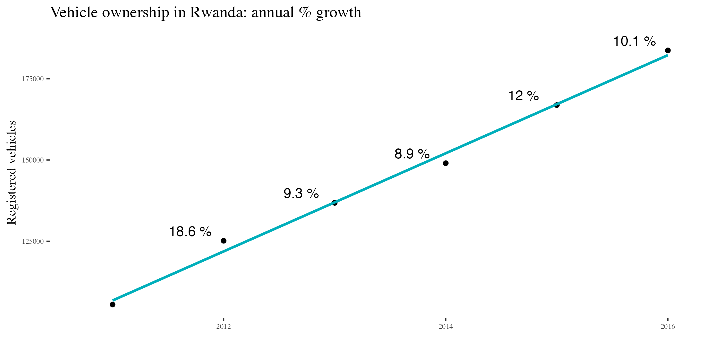

# Estimate the Market Size for Electic and Plug-In Hybrid Vehicles In Africa
The goal of this repository is to use open data repositories to answer the following questions: What is the estimated market size of electric and hybrid vehicles in Africa? What is the cost effectiveness of investing in electric vehicles as a public good to clean-up the air of all major African cities? What are environmental externalities generated by the extraction of natural resources such as **Cobalt and Lithium** to supply the appetite for batteries for electric vehicles?

#### Import required libraries
```
library(CausalImpact)
library(tidyverse)
```


#### Case Study: Rwanda

Let us start with Rwanda as an example to understand trends in vehicle ownership. According to a report by Bajpai and Bower(2020) from the International Growth Center, there were approximately 221,000 registered vehicles in Rwanda. The same study also states that the growth in vehicle ownership stood at 12% year-over-year. An older(2018) summary report by the Rwanda Bureau of Statistics reported the following trend in vehicle ownership: 

|Year    | N Registred Vehicles 
|---     |--------------------|
|2011    |105545              |
|2012    |125159              |
|2013    |136824              |
|2014    |149012              |
|2015    |166893              |
|2016    |183703              |
-------------------------------
-------------------------------
**Source:** *https://theatlas.com/charts/HkTy5aw5G*

A simple plot shows that the growth in vehicle ownership in Rwanda follows a linear trend line. Assuming the data is reliable, we can easily make predictions about future ownership. 

```
rw_auto_ownership <- 
  data.frame(year = 2011:2016, 
             n_registered = c(105545, 125159,  136824, 149012, 166893, 183703)) %>% 
  # Calculate growth rate
  mutate(prev_year = lag(n_registered, 1), change = n_registered - prev_year) %>% 
*  mutate(pct_growth = round((change/prev_year)*100, 2)) %>% 
  mutate(pct_growth_str = ifelse(!is.na(pct_growth),paste0(pct_growth, " %"), pct_growth))

 ggplot(rw_auto_ownership, aes(x = year, y = n_registered)) + 
*  geom_point() + 
  geom_text(aes(x=year-0.3,y= n_registered + 3000, label = pct_growth_str), cex = 4) +
  geom_smooth(method = "lm", se = FALSE, aes(color = "brown")) +
  ggtitle("Vehicle Ownership in Rwanda: Annual % Growth") + 
  xlab("Year") +
  ylab("Registered vehicles") + 
  scale_color_manual(values = c("#00AFBB")) +
  theme(axis.text = element_text(size = 6), legend.position = "None")
```



Given the clear *linearity* observed in this time series, we focus on two properties in our modeling: 

**_1._ Trend **

**_2._ Correlation.**


#### References: 

Jitendra, B and Jonathan B (2020). A road map for e-mobility transition in Rwanda
  (Policy brief 200018). International Growth Centre. from
  https://www.theigc.org/wp-content/uploads/2020/05/Bajpai-and-Bower-2020-policy-brief.pdf 
  


