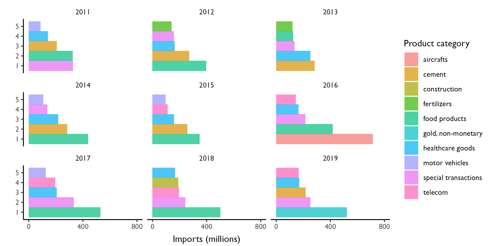

# Estimate the Market Size for Electic and Plug-In Hybrid Vehicles In Africa
The goal of this repository is to use open data repositories to answer the following questions: What is the estimated market size of electric and hybrid vehicles in Africa? What is the cost effectiveness of investing in electric vehicles as a public good to clean-up the air of all major African cities? What are environmental externalities generated by the extraction of natural resources such as **Cobalt and Lithium** to supply the appetite for batteries for electric vehicles?


#### Background 


#### Data Sources
We use the World Bank's World Development Indicator APIs to pull trade data from the World Bank database. Additionally, we rely on **International Trade Data** from the Harvard data-verse. This source is richer and has more detailed information related to the flow of goods and services between countries.  


Using the **wb_search()** function, we search for all indicators that are related to trade. Display some of them and their corresponding descriptions. Of the trade metrics found, exclude those without a valid description. For consistency, we limit ourselves to indicators that are measured in **US dollars.**  

#### Import required libraries
```
library(TSstudio)
library(plotly)
library(forecast)
library(finnts)
library(tidyverse)
```


#### Case Study: Rwanda

Let us start with Rwanda as an example to understand trends in vehicle ownership. According to a report by Bajpai and Bower(2020) from the International Growth Center, there were approximately 221,000 registered vehicles in Rwanda. The same study also states that the growth in vehicle ownership stood at 12% year-over-year. An older(2018) summary report by the Rwanda Bureau of Statistics reported the following trend in vehicle ownership: 

|Year    |Registred Vehicles   |% Growth| 
:---------|:-------------------|:-------|
|2011    |105545               |-       |
|2012    |125159               |18.6%   |
|2013    |136824               |9.3%    |
|2014    |149012               |8.9%    |
|2015    |166893               |12%     |
|2016    |183703               |10.1%   |
----------------------------------------


Rwanda can improve her trade balance by using fewer vehicles that consume petrol. We use empirical evidence to show that it is more cost effective to replace, albeit in a phased out manner that doesn't harm the national budget, the vehicle fleets belonging to all major government institutions.

**Definition of terms:**
- trade balance = imports - exports
- BEV = imports - exports
- Hybrid = imports - exports
- MPG = imports - exports

Show key determinants of Rwanda's trade balance over time. 



**Electric and hybrid vehicles might be the solution:**


#### References: 

Jitendra, B and Jonathan B (2020). A road map for e-mobility transition in Rwanda (Policy brief 200018). International Growth Centre. https://www.theigc.org/wp-content/uploads/2020/05/Bajpai-and-Bower-2020-policy-brief.pdf 
  
Krispin, Rami. Hands-On Time Series Analysis with R: Perform time series analysis and forecasting using R. Packt Publishing Ltd, 2019.

Jesse Piburn (2020). wbstats: Programmatic Access to the World Bank API. Oak Ridge
  National Laboratory. Oak Ridge, Tennessee. URL
  https://doi.org/10.11578/dc.20171025.1827
  
John Graves(2019). health-care-markets: Defining Markets for Health Care Services.
  Vanderbilt University Medical Center. Nashville, TN. URL 
  https://github.com/graveja0/health-care-markets
  
The Growth Lab at Harvard University. International Trade Data (SITC, Rev. 2).
  2019-05-31. 2019. V5. Harvard Dataverse. URL. https://doi.org/10.7910/DVN/H8SFD2. 
  doi/10.7910/DVN/H8SFD2

Matt Grainger (2021). SDGsR: Interface with the UN SDGs API to get data about the 
  Sustainable Development Goals. R package version
  0.0.0.9000. https://drmattg.github.io/SDGsR/
